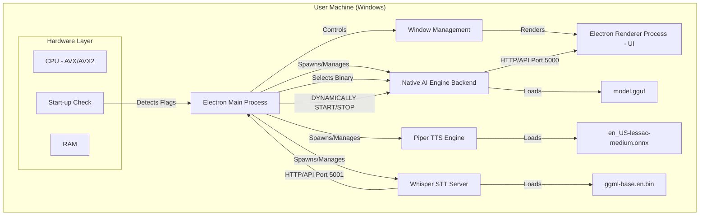
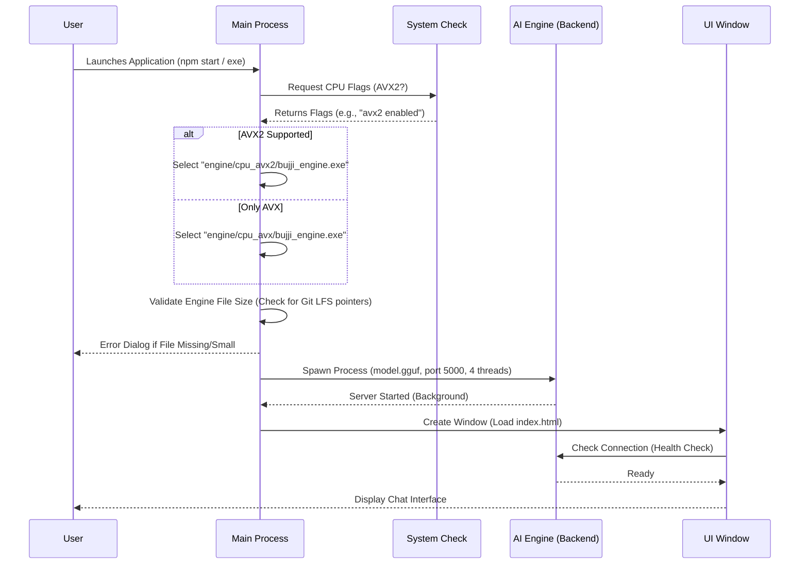

# RemiAI Framework - Technical Report

## 1. Executive Summary
This report details the internal architecture and operational flow of the **RemiAI Framework (v2.1)**, an open-source, Electron-based desktop application designed for offline AI interaction. The framework allows users to run Large Language Models (LLMs) locally in GGUF format. Key improvements in this version include **Dynamic Resource Management** to lower system footprint and **Robust Audio Processing** for STT authentication.

## 2. System Architecture

The application follows a standard **Electron Multi-Process Architecture**, enhanced with a custom **Native AI Backend**.

### 2.1 Block Diagram



### 2.2 Component Breakdown

1.  **Electron Main Process (`main.js`)**:
    *   **Role**: The application entry point and central controller.
    *   **New Capabilities**:
        *   **Dynamic Resource Management**: Listens for IPC events (`feature-switched`) from the renderer. If the user switches away from the Chat view (e.g., to STT or Browser), it **kills** the background AI process to save resources. It automatically spawns it again when the user returns to Chat.
        *   **Debug Logging**: Writes detailed logs to `Desktop/app_debug.log` to aid in diagnosing packaged application issues.
        *   **Manual Audio Conversion**: For STT, it now uses `ffmpeg` explicitly to convert input audio to the required 16kHz WAV format before passing it to the Whisper engine, preventing "No speech detected" errors.
    *   **Responsibilities**:
        *   Lifecycle management (Start, Stop, Quit).
        *   Hardware Detection using `systeminformation` to check for AVX/AVX2 support.
        *   **Engine Selection**: Dynamically chooses the correct binary (`cpu_avx2` or `cpu_avx`) to maximize performance or ensure compatibility.
        *   **Backend Spawning**: Launches the `bujji_engine.exe` (optimized `llama.cpp` server) as a child process.
        *   **Window Creation**: Loads `index.html`.

2.  **Native AI Engine (Backend)**:
    *   **Role**: The "Brain" of the application.
    *   **Technology**: Pre-compiled binaries (likely based on `llama.cpp`) optimized for CPU inference.
    *   **Binaries**: `bujji_engine.exe` located in `engine/cpu_avx/` and `engine/cpu_avx2/`.
    *   **Operation**: Runs a local server on port `5000`.
    *   **Model**: Loads weights strictly from a file named `model.gguf`.
    *   **No Python Required**: The binary is self-contained.
    *   **Git LFS integration**: Large binaries (`.exe`, `.dll`) are tracked via Git LFS.

3.  **TTS Engine (Piper)**:
    *   **Role**: Text-to-Speech synthesis — converts typed text into natural-sounding speech.
    *   **Technology**: Piper TTS (`piper.exe`), an ONNX-based neural TTS engine.
    *   **Binaries**: `piper.exe` in `engine/cpu_avx/` and `engine/cpu_avx2/`.
    *   **Model**: `en_US-lessac-medium.onnx` (English, medium quality voice) stored in `engine/piper/`.
    *   **Bundled DLLs**: `piper_phonemize.dll`, `onnxruntime.dll`, `espeak-ng.dll`.
    *   **Output**: WAV audio files saved to the system temp directory.

4.  **STT Engine (Whisper Server)**:
    *   **Role**: Speech-to-Text transcription — extracts text from audio files.
    *   **Technology**: Whisper.cpp server build (`whisper.exe`), runs as an HTTP server.
    *   **Binaries**: `whisper.exe` in `engine/cpu_avx/` and `engine/cpu_avx2/`.
    *   **Model**: `ggml-base.en.bin` (English base model) stored in `engine/whisper/`.
    *   **Bundled DLLs**: `whisper.dll`, `ggml.dll`.
    *   **Audio Format Support**: `.wav`, `.mp3`, `.m4a`, `.ogg`, `.flac` — requires `ffmpeg.exe` and `ffmpeg.dll` in `bin/`.

## 3. Operational Flow Chart

Detailed step-by-step process of the application startup:



## 4. Technical Specifications & Requirements

### 4.1 Prerequisites
*   **Operating System**: Windows (10/11) 64-bit.
*   **Software**: Git & Git LFS (Required for downloading engine binaries).
*   **Runtime**: Node.js (LTS version recommended).
*   **Hardware**: 
    *   Any modern CPU (Intel/AMD) with AVX support.
    *   Minimum 8GB RAM (16GB recommended for larger models).
    *   Disk space proportional to the model size (e.g., 4GB for a 7B model).

### 4.2 File Structure & Dependencies
The critical file structure required for the app to function:

```text
Root/
├── engine/                     # AI Backend Engines
│   ├── cpu_avx/                # Fallback binaries (AVX)
│   │   ├── bujji_engine.exe    # LLM inference server
│   │   ├── piper.exe           # TTS engine
│   │   └── whisper.exe         # STT server
│   ├── cpu_avx2/               # High-performance binaries (AVX2)
│   │   ├── bujji_engine.exe
│   │   ├── piper.exe
│   │   └── whisper.exe
├── bin/                        # Utility binaries
│   ├── ffmpeg.exe              # Audio conversion (required for STT)
│   ├── ffmpeg.dll              # FFmpeg library
│   └── ffplay.exe              # Audio playback
├── model.gguf                  # The AI Model
├── package.json                # Dependencies
└── node_modules/               # Installed via npm install
```

### 4.3 Framework Constraints & Packaging

*   **Model Format Support**:
    *   **Text Generation**: Strictly requires **GGUF** format.
    *   **Speech-to-Text**: Requires **GGML Binary** format (`ggml-*.bin`).
    *   **Text-to-Speech**: Requires **ONNX** format (`.onnx` + `.json` config).
*   **Packaging Limit**:
    *   The framework uses **NSISBI** (Large Installer Support).
    *   **Tested Packaging Size**: Up to **~3.1GB** successfully.

## 5. Offline-First Architecture

The framework is designed to be **100% offline-capable** after initial setup:

*   **No CDN Dependencies**: All frontend libraries (Lucide icons, Marked.js) are bundled locally via `node_modules/`.
*   **Local Engine Binaries**: All AI engines (`bujji_engine.exe`, `piper.exe`, `whisper.exe`) and their DLLs are included in the `engine/` directory.
*   **Bundled Models**: TTS model (`en_US-lessac-medium.onnx`), STT model (`ggml-base.en.bin`), and the LLM model (`model.gguf`) are all stored locally.
*   **Audio Utilities**: `ffmpeg.exe` and `ffplay.exe` are bundled in `bin/` for audio format conversion and playback.

## 6. Development & Open Source Strategy

### 6.1 Licensing & Credits
The RemiAI Framework is released under the **MIT License**, permitting free use, modification, and distribution.

#### Third-Party Components
This project relies on robust open-source projects. We gratefully acknowledge:
*   **Llama.cpp** (Backend `bujji_engine.exe`): [MIT License](https://github.com/ggerganov/llama.cpp)
*   **Piper TTS** (Speech Synthesis): [MIT License](https://github.com/rhasspy/piper)
*   **Whisper.cpp** (Speech Recognition): [MIT License](https://github.com/ggerganov/whisper.cpp)
*   **Gemma 2 Model** (AI Weights): [Gemma Terms of Use](https://ai.google.dev/gemma/terms)

### 6.2 Hosting Strategy
*   **GitHub**: Contains the source code (JS, HTML, CSS).
*   **Hugging Face**: Hosts the large `model.gguf` file and the zipped release builds due to storage limits on GitHub. We use Hugging Face for "Large File Storage" of the AI weights.

## 7. Conclusion
The RemiAI/Bujji framework democratizes access to local AI. By removing the complex Python environment setup and packaging the inference engine directly with the app, we enable any student with a laptop to run powerful AI models simply by typing `npm start`.
